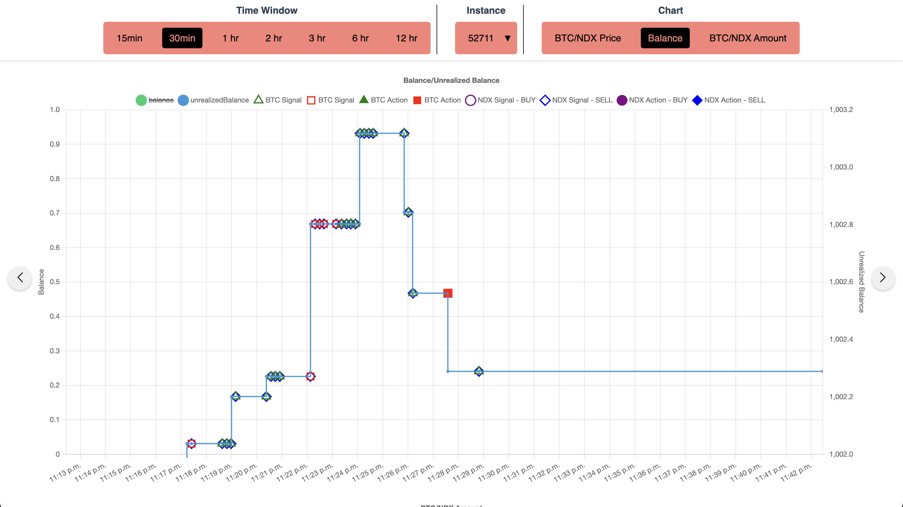

# BTC-NDX-Trade-BPM

BTC/NDX trade Business Process Model

### 1. Create .env file

- Put given .env file with corresponding COIN_MARKET_CAP_API_KEY and MODEL_UUID to the main folder.

### 2. Build Dashboard Client

```sh
cd client # Navigate to client folder
npm i # Install libraries
npm run build # Build public files
cd .. ## Navigate to main folder
```

### 3. Build and start backend

```sh
npm i
npm start
```

### 4. Start the BPM at the TUM-Prak-24-WS.dir/Koray%20Cetin.dir/

- Navigate to the
  `https://{TUM_BPM_PREFIX}/TUM-Prak-24-WS.dir/Koray%20Cetin.dir`
  and start a new **BTC_NDX Trader** process model.

### 5. See the events in the dashboard.

- Navigate to the [dashboard url](https://lehre.bpm.in.tum.de/ports/14533/dashboard/).
- Select your process model instance id from the top dropdown menu.
- Feel free to select time windows _eg. 15min, 1hr..._ and different charts _eg. Price, Balance, Amount_.
- Also iterate through previous/next time intervals, using the arrow buttons on each side of the screen.
- In each chart you can toggle on/off a component. For example you can only select NDX price or BTC Price etc.

- Below is an example visualization chart:
  
